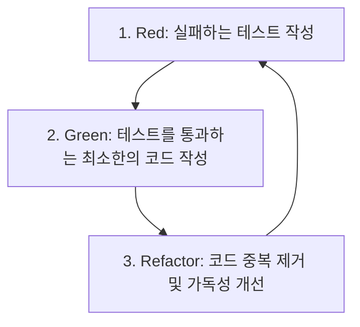

# Task Matrix (TDD-Verified Todo Dashboard)

React 19, Next.js 16 (v16.2.9) 및 TailwindCSS v4 기반으로 구축된 **TDD(테스트 주도 개발) 방식의 할 일 관리 대시보드**입니다. 핵심 비즈니스 로직에 대해 100% Jest 테스트 커버리지를 보장하며, Shadcn UI와 다크 모드 감성의 모던한 UI 디자인을 결합하여 완성도 높은 사용자 경험을 제공합니다.

---

## 1. 프로젝트 진행 내용 요약

프로젝트의 핵심 비즈니스 로직과 UI 레이어는 관심사 분리(Separation of Concerns) 원칙에 따라 철저히 모듈화되어 구현되었습니다.

### ⚙️ Core & 비즈니스 로직 (TDD 검증 완료)
- **도메인 모델 설계**: [todo.ts](file:///c:/WorkSpace/AntiGravity/4_1_TDD/src/types/todo.ts) 파일에 `Todo` 인터페이스(`id`, `title`, `completed`, `createdAt`)를 정의하여 데이터 구조를 구체화했습니다.
- **핵심 CRUD 함수 개발**: [todo.ts](file:///c:/WorkSpace/AntiGravity/4_1_TDD/src/lib/todo.ts)에 상태 변이를 안전하게 처리하는 순수 함수들을 작성했습니다.
  - `addTodo`: 새 할 일을 불변 객체로 추가 (공백 예외 처리 및 100자 제한 적용)
  - `getTodo`: 저장된 목록을 최신 생성일자 순(내림차순)으로 정렬하여 조회
  - `toggleTodo`: 완료 여부를 반전 처리
  - `deleteTodo`: 특정 항목 제거
  - `updateTodo`: 기존 항목의 제목을 수정 (공백 예외 처리)
- **단위 테스트 작성**: [todo.test.ts](file:///c:/WorkSpace/AntiGravity/4_1_TDD/src/lib/todo.test.ts)에 Jest 프레임워크를 적용하여 예외 상황을 포함한 15개의 시나리오 테스트 케이스를 구축하고 모두 통과시켰습니다.

### 🎨 프론트엔드 UI 대시보드
- **모던한 Dark/Glassmorphism 테마**: 어두운 인디고 및 슬레이트 그라디언트 배경 위에 입체감 있는 카드 UI와 퍼플-핑크 그라디언트 효과를 적용했습니다.
- **실시간 대시보드 피드백**: 전체 등록 개수 대비 완료 개수를 실시간으로 계산하는 **진행률 게이지 바(Progress Bar)**와 TDD 인증 뱃지를 상단에 배치했습니다.
- **다이얼로그 기반 수정 및 예외 전파**: 사용자 경험을 극대화하기 위해 수정 동작은 Shadcn UI의 Dialog(Modal) 창으로 처리하였으며, 비즈니스 로직 함수에서 발생한 예외(공백 경고, 100자 초과 오류 등)를 UI 상단 경고 팝업으로 사용자에게 즉시 전달하도록 설계했습니다.

---

## 2. TDD(테스트 주도 개발) 기반 테스트 방법론

### TDD 3단계 주기 (Red - Green - Refactor)
TDD는 실제 코드를 작성하기 전에 **테스트 코드를 먼저 작성**하는 개발 방법론입니다.



1. **Red**: 구현할 기능의 요구사항과 예외조건을 테스트 케이스로 정의하고 실행하여 **실패(Red)**하는 것을 확인합니다.
2. **Green**: 실패한 테스트를 가볍게 통과(Pass)할 수 있도록 구조에 상관없이 **최소한의 실제 코드(Green)**를 작성합니다.
3. **Refactor**: 테스트 통과가 유지되는 상태에서 실제 코드의 중복을 제거하고, 클린 코드로 **리팩토링(Refactor)**합니다.

---

## 3. 코드 기반 TDD 프로세스 설명 & 사용 예시

### [Step 1] 테스트 명세 작성 (Red Phase)
기능을 구현하기 전, 먼저 테스트 파일인 `todo.test.ts`에 요구사항을 정의합니다. 

아래 코드는 **"새 할 일을 추가할 때 제목이 비어있으면 에러를 던져야 한다"**는 요구사항을 정의한 테스트 케이스 예시입니다.

```typescript
// src/lib/todo.test.ts 에서 발췌
describe('addTodo - 새 할 일 추가', () => {
  let initialTodos: Todo[] = [];

  it('빈 문자열이나 공백만 있는 제목을 입력하면 예외(Error)를 발생시킨다.', () => {
    // 1. 동작 실행 시 에러가 발생하는지 미리 명세 작성
    expect(() => addTodo(initialTodos, '')).toThrow('할 일 제목은 비어 있을 수 없습니다.');
    expect(() => addTodo(initialTodos, '   ')).toThrow('할 일 제목은 비어 있을 수 없습니다.');
  });
});
```

*이 시점에는 `addTodo` 함수가 없거나 예외 처리가 구현되지 않았기 때문에 `npm run test` 실행 시 테스트가 **실패(Red)**하게 됩니다.*

### [Step 2] 실제 기능 구현 (Green Phase)
테스트를 통과하기 위한 최소한의 유효성 검사 및 로직을 구현 파일인 `todo.ts`에 작성합니다.

```typescript
// src/lib/todo.ts 에서 발췌
import { Todo } from '../types/todo';

export function addTodo(todos: Todo[], title: string): Todo[] {
  // 1. 테스트에서 요구한 예외 조건을 충족하여 에러 발생시킴 (Green 확보)
  if (!title || title.trim() === '') {
    throw new Error('할 일 제목은 비어 있을 수 없습니다.');
  }

  const newTodo: Todo = {
    id: Math.random().toString(36).substring(2, 9),
    title: title.trim(),
    completed: false,
    createdAt: new Date(),
  };

  return [...todos, newTodo];
}
```

*이제 코드가 작성되어 테스트를 다시 실행하면 **성공(Green)**으로 변경됩니다.*

### [Step 3] 코드 리팩토링 (Refactor Phase)
테스트 안정성을 유지하면서 아이디 생성 방식을 표준 API(`crypto.randomUUID`)를 활용하는 방식으로 가독성 높고 안전하게 리팩토링합니다. 이미 테스트 코드가 버팀목이 되어주므로 안심하고 코드를 수정할 수 있습니다.

```typescript
// 리팩토링된 ID 생성 헬퍼와 로직 구조
function generateId(): string {
  if (typeof crypto !== 'undefined' && crypto.randomUUID) {
    return crypto.randomUUID();
  }
  return Math.random().toString(36).substring(2, 9) + Date.now().toString(36);
}

export function addTodo(todos: Todo[], title: string): Todo[] {
  if (!title || title.trim() === '') {
    throw new Error('할 일 제목은 비어 있을 수 없습니다.');
  }
  if (title.length > 100) {
    throw new Error('할 일 제목은 100자를 초과할 수 없습니다.');
  }

  return [
    ...todos,
    {
      id: generateId(),
      title: title.trim(),
      completed: false,
      createdAt: new Date(),
    }
  ];
}
```

---

## 4. 테스트 실행 방법 및 결과

### 🏃 테스트 실행 명령어
프로젝트 루트 디렉토리에서 아래 명령어를 실행하여 테스트를 수행합니다.

```bash
npm run test
```

### 📊 테스트 수행 결과
Jest 프레임워크가 `src/lib/todo.test.ts` 파일의 15개 핵심 비즈니스 로직에 대해 검증을 수행하고 출력하는 결과 요약입니다.

```text
PASS src/lib/todo.test.ts
  Todo TDD 핵심 기능 테스트
    addTodo - 새 할 일 추가
      √ 유효한 제목으로 추가하면 새 할 일이 추가되고 기존 목록이 유지된다. (5 ms)
      √ 빈 문자열이나 공백만 있는 제목을 입력하면 예외(Error)를 발생시킨다. (18 ms)
      √ 제목이 100자를 초과하는 경우 예외(Error)를 발생시킨다. (2 ms)
    getTodo - 전체 목록 조회 및 정렬
      √ 전체 목록을 조회하면 저장된 모든 할 일 목록을 반환한다. (1 ms)
      √ 빈 목록일 경우 빈 배열을 반환한다. (2 ms)
      √ 생성일자(createdAt) 기준 내림차순(최신순)으로 정렬하여 반환한다. (1 ms)
    toggleTodo - 완료 상태 토글
      √ 특정 ID를 제공하면 해당 할 일의 완료 상태(completed)를 토글한다. (1 ms)
      √ 존재하지 않는 ID를 토글하려고 하면 원본 목록을 그대로 반환한다.
      √ 빈 목록에서 토글을 시도하면 빈 배열을 그대로 반환한다. (1 ms)
    deleteTodo - 할 일 삭제
      √ 특정 ID를 제공하면 해당 할 일을 목록에서 삭제한다.
      √ 존재하지 않는 ID를 삭제하려고 하면 원본 목록을 그대로 반환한다. (1 ms)
      √ 여러 개의 할 일 중 정확히 지정된 ID의 항목만 삭제한다.
    updateTodo - 할 일 수정
      √ 특정 ID와 새 제목을 제공하면 해당 할 일의 제목을 수정한다. (1 ms)
      √ 수정하려는 제목이 빈 문자열이거나 공백만 있는 경우 예외를 발생시킨다. (1 ms)
      √ 존재하지 않는 ID의 제목을 수정하려고 하면 원본 목록을 그대로 반환한다.

Test Suites: 1 passed, 1 total
Tests:       15 passed, 15 total
Snapshots:   0 total
Time:        5.614 s
Ran all test suites.
```

---

## 5. 시작 가이드 (Getting Started)

의존성 패키지를 설치하고 로컬 개발 서버를 기동합니다.

```bash
# 1. 의존성 설치
npm install

# 2. 로컬 개발 서버 기동
npm run dev
```

브라우저에서 [http://localhost:3000](http://localhost:3000)으로 접속하여 아름다운 Task Matrix 대시보드를 직접 경험해보세요!
